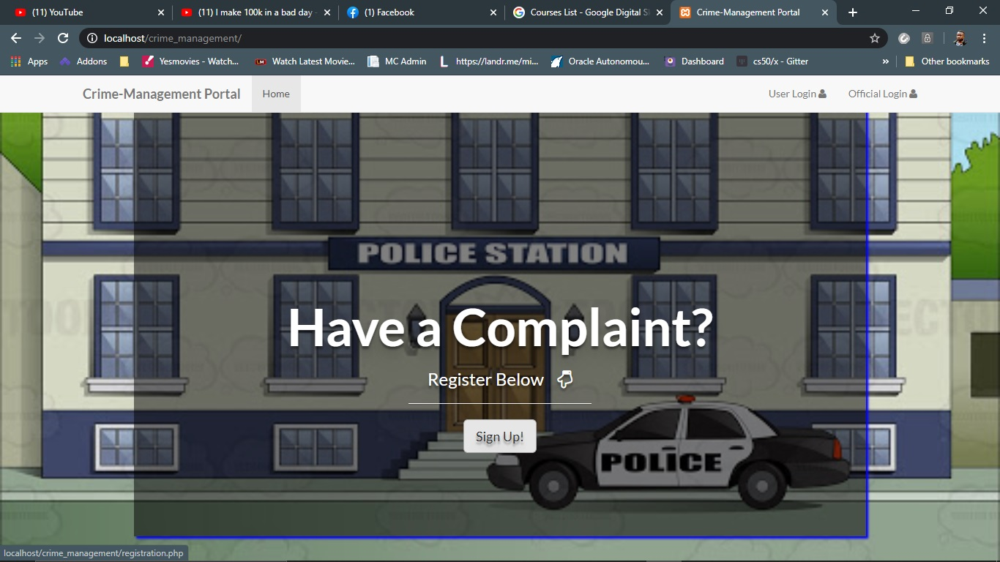
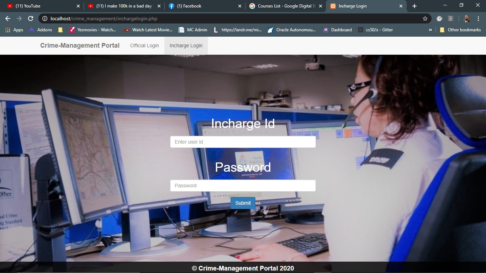
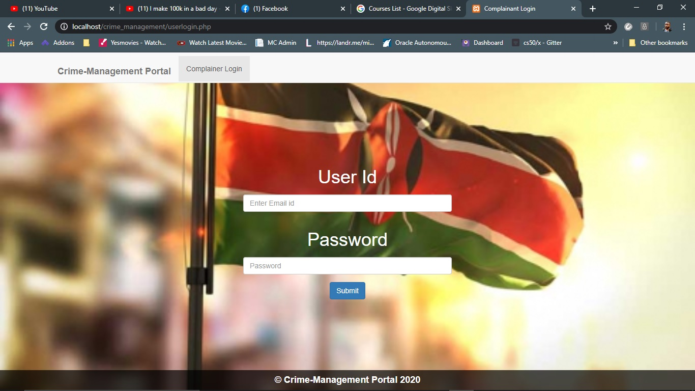
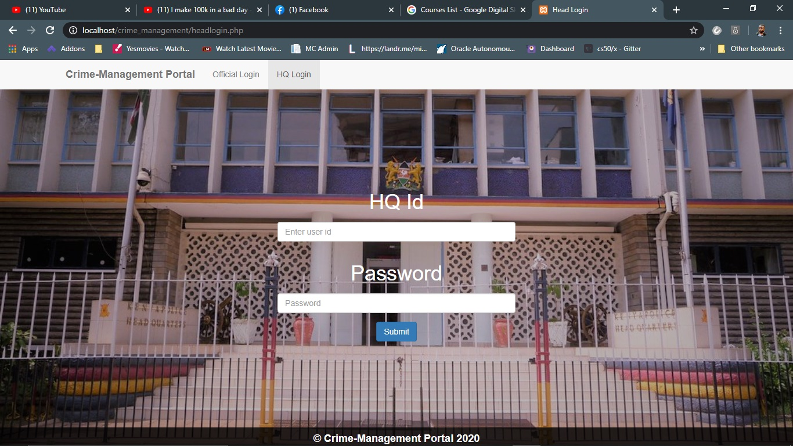
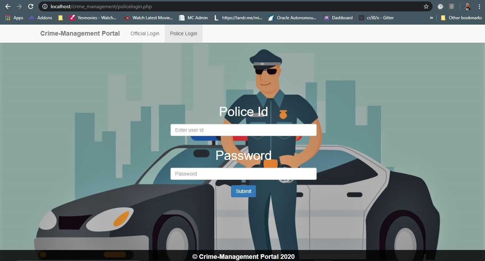

# Experienced IT specialist with a demonstrated history of working in the computer networking industry. Creative developer/innovator in love of independence, with a passion for designing beautiful and functional systems.

# Criminal Management System
PHP Project: It is a website  based system. This website has 4 module- Head-quarter, Incharge, Police, User. It is multifunctional website with back end support
  Project Objective:
  1. •	To provide an online platform where user can log in at ease.
  2. •	Complainant can see the regular update of the filed case.
  3. •	Head Quarter can easily monitor the update of individual case.
  4. •	To provide transparency in working system of the case.
  
  
Project Scope :  
  Complainant Module:-

	Complainant can file online and can see the regular update of the filed case. 
	He/She can file multiple  cases .

HQ Module:- 

	HQ can monitor every case.
 
	HQ can add or delete the police station.

	HQ will provide login credential to Incharge. 

Incharge Module:-

	Incharge can see the case allocated to his location.

	He/She can add police officers for his/her location. 

	Incharge will assign the case to each police.

	Incharge will provide login credential to Police.

Police Module:-

	Police can only see the details of that case which has been assigned by the Incharge.
	Police can update the status of each case.
	Police can close the case and file the chargesheet.

Future scope of Improvements:
    	OTP verification can be added to authenticate the user.
    	Data Sharing between police station can be incorporated.
    	Chat Support Between Officers can be added.
    	Location of crime will be automatically detected just by pointing on the map. 

Screenshots (Few) :
    
    
    
    
    
    
    
  
